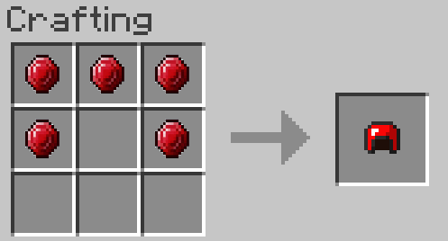
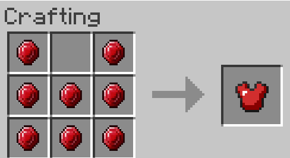
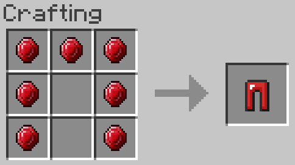
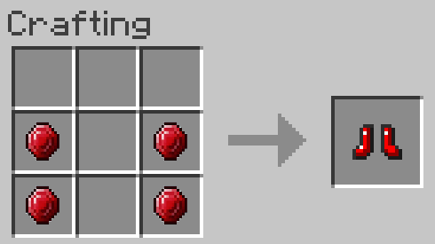

==========
Ruby Armor
==========
Armor made out of :doc:`rubies <../Items/ruby>`, slightly weaker than diamond

.. image:: ../.static/ruby_sword_and_armor.png
  :width: 450
  :alt: A ruby armor set

Crafting
--------
put :doc:`rubies <../Items/ruby>` in the shape of the armor piece you want, simple

