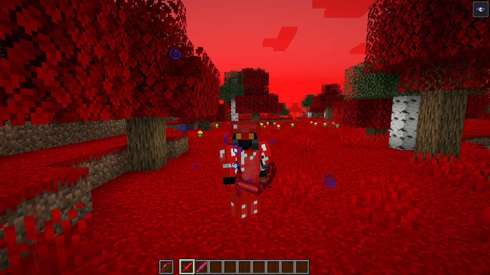

==========
Ruby Armor
==========
Armor made out of :doc:`rubies <../Items/ruby>`, slightly weaker than diamond

Crafting
--------
put :doc:`rubies <../Items/ruby>` in the shape of the armor piece you want, simple

(Images needed)