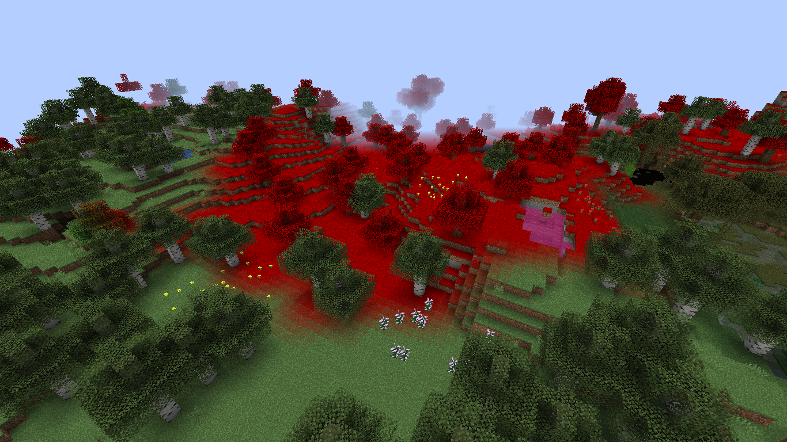

Biomes
======

==========
Ruby biome
==========

The Ruby biome is a red biome that has semi-normal worldgen, also has a red tint. 
It's the only biome currently that has :doc:`Dense ruby ore <Blocks/Dense_Ruby_Ore>`

