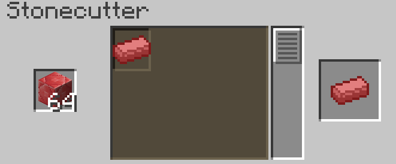

==========
Ruby Ingot
==========

The ruby ingot is just used to craft :doc:`Strengthened diamond <Strong_diamond>`

Crafting
--------
Put 1 :doc:`Ruby Block <../Blocks/Block_Of_Ruby>` in a stoncutter

