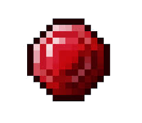

================================
Welcome to JARM's documentation!  
================================

 this is the Docs and how to get started 
 with JARM.

   .. note:: Now that JARM fabric edition is being worked on some parts of the docs will be removed and will be updated with alot more details as right now nothing especially needed is being worked on.
                       

.. toctree::
   :maxdepth: 2 
   :caption: Contents: 
   :glob: 

   Getting_Started
   Items
   Blocks
   Tools
   Armor
   Biomes
   

Indices and tables
==================

* :ref:`genindex`
* :ref:`modindex`
* :ref:`search`
