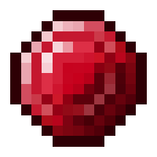

================================
Welcome to JARM's documentation!  
================================

 this is the Docs and how to get started 
 with JARM         
                       

.. toctree::
   :maxdepth: 2 
   :caption: Contents: 
   :glob: 

   Getting_Started
   Items
   blocks
   Armor
   Biomes
   Dimensions
   
(this documentation is in beta and currently only 1 person is updating it in his freetime, so dont expect there to be most thing nor most details yet, but it will be added in like 1 week)

Indices and tables
==================

* :ref:`genindex`
* :ref:`modindex`
* :ref:`search`
